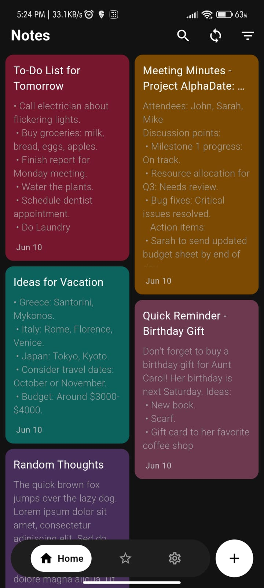
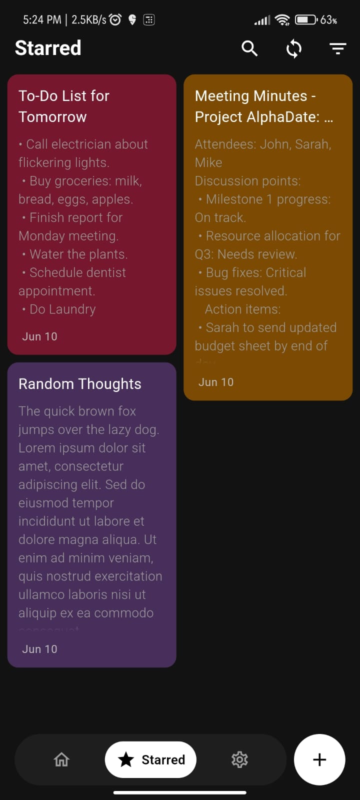
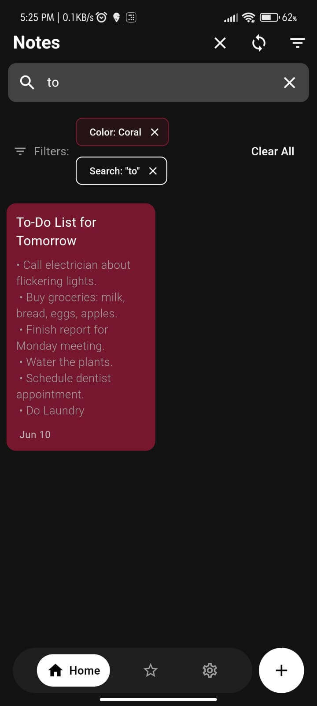
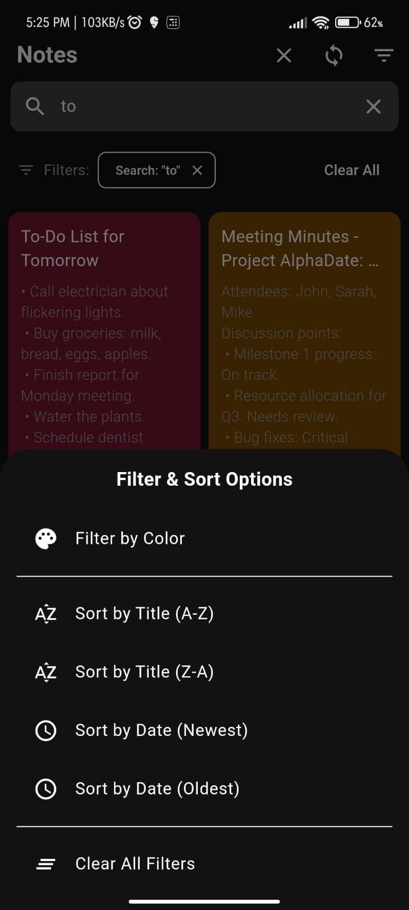
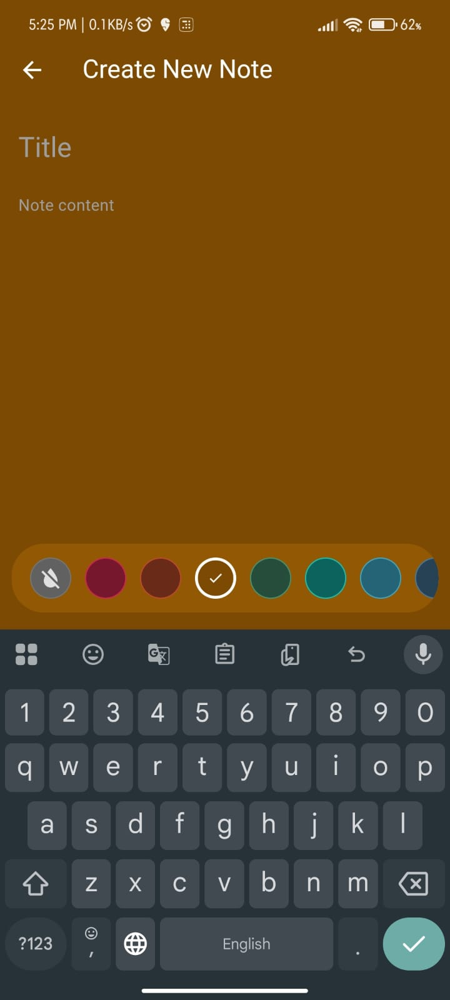
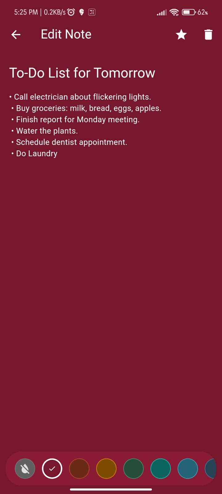
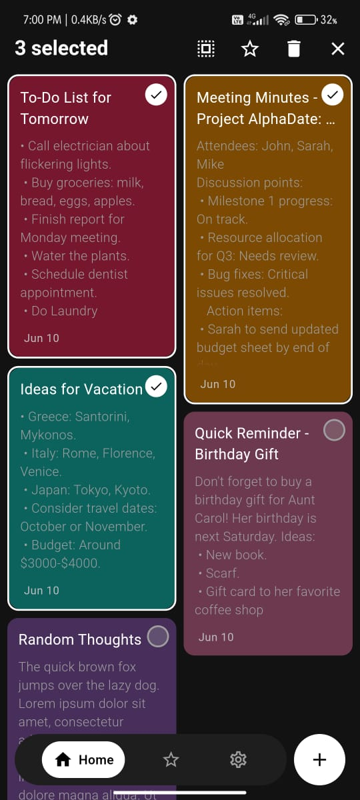

# 📝 Notes On Short - Flutter Notes App

**Notes On Short** is a comprehensive, cross-platform notes application developed using **Flutter**. It allows users to efficiently create, organize, and manage notes with advanced features like color coding, note searching, and filtering.

This project demonstrates clean architecture, efficient state management, and integration of both local and cloud storage solutions.

---

## 🚀 Features
- ✅ **Create, Edit & Delete Notes**
- ✅ **Local Storage using Isar Database (Fast & Offline-First)**
- ✅ **Manual Cloud Sync via Firebase Firestore**
- ✅ **Starred Notes for Quick Access**
- ✅ **Color Coded Notes for Easy Organization**
- ✅ **Search Notes by Title or Content**
- ✅ **Filter Notes by Color Tags**
- ✅ **Cross-Platform:** Android & iOS
- ✅ **Responsive UI**

---

## 🏗️ Architecture & Tech Stack
- **Flutter** (Dart) - Cross-platform UI framework
- **Isar Database** - Local, NoSQL, high-performance storage
- **Firebase Firestore** - Cloud database for manual sync
- **Provider** - State Management
- **Feature Folder Architecture + MVC Pattern**
  - Organized, scalable project structure for ease of maintenance.

---

## 📂 Project Structure

```plaintext
.vscode/
    └── settings.json

android/
    ├── app/
        ├── src/
            ├── main/
                ├── kotlin/
                    └── com/
                        └── example/
                            └── notes_on_short/
                                └── MainActivity.kt
                ├── res/
                    └── values/
                        ├── colors.xml
                        └── styles.xml
                └── AndroidManifest.xml
        ├── build.gradle
        └── google-services.json
    ├── gradle/
        └── wrapper/
            └── gradle-wrapper.properties
    ├── build.gradle
    ├── gradle.properties
    └── settings.gradle

ios/
    ├── Runner/
        ├── AppDelegate.swift
        ├── Info.plist
    └── Runner.xcodeproj/
        └── project.pbxproj

lib/
    ├── common/
        └── widgets/
            ├── button.dart
            ├── confirmation_dialog.dart
            ├── google_sign_in_button.dart
            ├── notes_bottom_app_bar.dart
            └── text_field.dart
    ├── data/
        └── services/
            └── firebase_options.dart
    ├── features/
        ├── authentication/
            ├── controllers/
                ├── auth_service.dart
                ├── email_auth.dart
                ├── google_auth.dart
                └── login_or_register_page.dart
            └── screens/
                ├── auth_page.dart
                ├── login_page.dart
                └── register_page.dart
        └── notes/
            ├── controllers/
                └── home_controller.dart
            ├── models/
                ├── note.dart
                └── note.g.dart
            ├── screens/
                ├── home/
                    ├── home_page.dart
                    └── home_view.dart
                ├── create_note_screen.dart
                ├── note_editing_screen.dart
                └── settings_page.dart
            ├── services/
                ├── firestore_service.dart
                ├── isar_service.dart
                └── notes_repository.dart
            └── widgets/
                ├── color_picker.dart
                ├── note_card.dart
                └── sync_button.dart
    ├── utils/
        ├── constants/
            ├── colors.dart
            ├── image_strings.dart
            └── sizes.dart
        ├── helpers/
            └── helper_functions.dart
        ├── themes/
            ├── dark_mode.dart
            ├── light_mode.dart
            └── theme_provider.dart
    └── main.dart

pubspec.yaml
pubspec.lock
README.md
.gitignore
firebase.json


```

## 📲 Installation & Setup
> ⚠️ This is a personal project for learning and portfolio purposes, not intended for production use.
> ### Prerequisites

- Flutter SDK (latest stable version)
- Dart SDK
- Android Studio / VS Code
- Firebase account

1. **Clone the repository**
```bash
git clone https://github.com/yourusername/your-repo.git
```

2. **Navigate to the project folder**
```bash
cd your-repo
```

3. **Fetch project dependencies**
```bash
flutter pub get
```

4. **Configure Firebase**
- Add your `google-services.json` (for Android) to `android/app/`
- Add your `GoogleService-Info.plist` (for iOS) to `ios/Runner/`
- Ensure Firebase is properly set up in your Firebase Console for Firestore

5. **Run the application**
```bash
flutter run
```

## 🧪 Testing

Run the test suite to ensure everything is working correctly:

```bash
flutter test
```

## 🌱 Future Improvements

- [ ] Automatic Cloud Sync in Background
- [ ] Cloud Conflict Resolution Strategies
- [ ] UI/UX Enhancements
- [ ] Multi-Device Syncing Support

## 📜 License

This project is built for educational and portfolio purposes only.

## 🎯 Purpose

This project showcases my ability to:

- Build scalable and maintainable Flutter applications
- Implement both local and cloud storage solutions
- Apply advanced state management techniques
- Architect apps following clean, modular principles
## 📸 Screenshots

### 📝 Notes App Screenshots

#### Home Screen



#### Starred Screen



#### Search and Filter



#### Filter Notes



#### Create Note Screen



#### Edit Note Screen



### Selecting Notes




---

*Built with ❤️ using Flutter*


